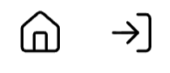

## Introduction:

    - Propsical is real estate marketplace website that also provides appointment management system.
    - This is to solve the hassle of managing appointments while buyer looking and viewing multiple properties, and seller to schedule buyers to view at their schedule.

## Getting started:

### Upon first visiting page

  

- it shows the login page with 2 icons at the navigation bar:
  - Home icon: this is explore all public listings created by the app as a guest user (without login)
  - Login icon: this is to login as an registered user

- After login, you will see both icons changed:
  - Listings icon: this is where registered user able to see own created listings
  - Logout icon: this is to logout as an registered user

### As guest user:

- When user is exploring the public listing page, can inspect one of the listings:

  - User is able to click on the listing and be directed to another dedicated page with all the details just for the listing.
  - User is able to click on the `Appointment` and be directed to the appointment booking page.
  - Then User can select the date and timing, and followed by inputting name and phone number before proceeding to click `Book Appointment`

- Registering as a new registered user:

- One simply just fill up username, password, name and phone number before clicking `Submit`

### As a registered user:

- Type username and password before clicking `Login`
- Upon logging in, it will show all listings that previous created by the user.
- The user can click on `New Listing` to create.

#### Creating new listings:

- Fill in all the information as shown and once clicked 'Submit', it will direct the user to the picture uploading page.

- Click on the `choose file` to select the file to be uploaded before clicking `Upload`
- The new image once uploaded will be shown below the `Upload`
- The user can delete any uploaded images by clicking on the trash icon

#### Manipulating existing created listings:

- The user can click on the listings icon at the navigation bar.
- There are 4 buttons:

  - `View` to be directed to the dedicated page with all the details just for the listing
  - `Update` to be directed to the editing page

    

    - To update the details and also able to re-upload the images

  - `Appointment` to be directed to the appointment booking and blocking page
  - `Delete` to delete the listing directly

#### Manipulating appointments booking & blocking:

- There are 2 calendar modes which is `Month` and `Day`:

  

  - `Day`: user can choose the date & timeslot to block or book appointment by filling in some description

    

    - And registered user can also unblock by deleting the blocked timeslots.

- `Month`: user can select the range of dates to be blocked so that guest user cannot book appointments on those dates
  - And registered user can also unblock by deleting the blocked dates.
